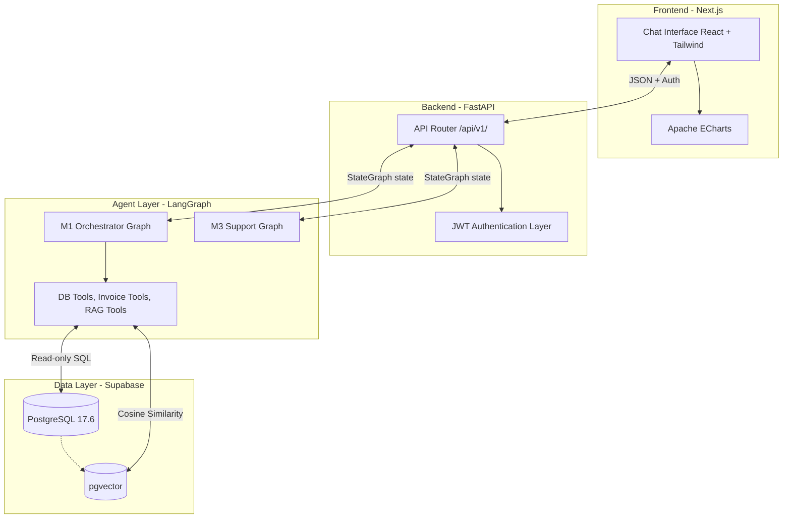

# PROJECT_KNOWLEDGE_BASE

## 1. Executive Summary
Wakeel (وكيل) is an ERP Agentic AI Platform designed to act as an "Agentic Intelligence Layer" operating directly on top of existing ERP databases. Its main business purpose is to transform natural language queries (in Arabic or English) into actionable insights, automate customer support, and enable operational decision-making. 

The target users include executives needing financial summaries, operational managers checking inventory/orders, and customer support representatives resolving disputes.

**Core Capabilities & Workflows**:
- **M1 Intelligence Agent**: Dynamic intent classification, safe SQL query generation (using a template-first strategy), invoice pattern analysis, and tax reasoning using RAG.
- **M3 Customer Support Agent**: Handles order status inquiries, invoice disputes, and customer history retrieval with human-in-the-loop (HITL) review gates.
- **Adaptive Output**: Intelligently renders data as metric cards, sortable tables, ECharts, or narratives.

---

## 2. System Architecture Overview
The system follows a modular, decoupled architecture where a React/Next.js frontend communicates via REST with a FastAPI backend. The backend acts as an orchestrator, invoking a LangGraph-based AI agent engine that interacts securely with a PostgreSQL database (Supabase) and OpenAI models.



---

## 3. Repository Structure
```text
project/
├── agents/             # Core AI logic (LangGraph, nodes, tools, prompts)
│   ├── m1/             # M1 Intelligence Agent (Fully Operational)
│   ├── m3/             # M3 Customer Support Agent
│   ├── prompts/        # System prompts for GPT models
│   └── shared/         # Shared LLM clients and utilities
├── backend/            # FastAPI backend application
│   ├── api/            # API endpoints/routers
│   ├── core/           # Config, DB connections, Auth, Logging
│   ├── middleware/     # Error handlers, CORS
│   └── services/       # Conversation logic, RAG pipelines, Audit logs
├── frontend/           # Next.js 14 bilingual chat interface
│   ├── app/            # Pages and routing
│   ├── components/     # UI components (MetricCard, LineChart, Chat)
│   └── lib/            # API clients, RTL utilities
├── data/               # Raw and processed knowledge base documents (e.g., Tax laws)
├── database/           # Schema definitions and migrations
├── docs/               # Architecture maps, execution logs, progress tracking
└── scripts/            # Testing suites, DB seeding, and RAG ingestion scripts
```

**Ownership & Dependencies**:
- **`agents/`**: Owned by AI Engineers. Highly dependent on `backend/core/database.py` and LangChain/LangGraph.
- **`backend/`**: Owned by Backend Engineers. Provides the API boundary. Dependent on FastAPI and SQLAlchemy.
- **`frontend/`**: Owned by Frontend Engineers. Dependent on Next.js, Tailwind, and ECharts. Interacts only with the `/api` boundary.

---

## 4. Entry Points
- **Backend Application Startup**: `backend/main.py`. This is the FastAPI entry point that wires routers (`m1_query`, `m3_support`), error handling middleware, and CORS.
- **AI Agent Execution Flow**: 
  - `backend/api/v1/m1_query.py` defines the `/query` endpoint.
  - It resolves multi-turn chat history via `ConversationService`.
  - It invokes the LangGraph state machine defined in `agents/m1/graphs/m1_graph.py`.
- **Frontend Execution Path**: 
  - `frontend/app/m1/page.tsx` is the primary chat interface.
  - Interaction logic is encapsulated in `frontend/hooks/useM1Query.ts`.
- **CLI/Background Workers**:
  - Evaluation and integration tests run via scripts in `scripts/` (e.g., `test_e2e_all_sprints.py`).
  - Document ingestion runs via `scripts/ingest_tax_docs.py`.

---

## 5. Module Breakdown

### M1 Intelligence Agent
**Purpose**: Transforms natural language queries into analytical insights using ERP data.
**Responsibilities**: Intent classification, SQL generation/execution, invoice pattern analysis, tax law RAG retrieval, output format selection.
**Key Classes/Files**:
- `IntentClassifierNode`: Identifies the user's intent.
- `RouterNode`: Routes to the correct tool.
- `DbQueryTool`: Safe, read-only SQL template execution.
- `InvoiceAnalysisToolNode`: Analyzes invoices for patterns (price changes, late payments).
- `TaxRagNode`: Retrieves tax knowledge and generates reasoned answers.
- `OutputSelectorNode`: Determines the optimal UI component (chart, table, narrative).
**Dependencies**: Supabase (Read-only role), pgvector, OpenAI GPT-4o.
**Modification Guidelines**: To add a new query type, add a SQL template in `db_query_tool.py`, update `intent_classifier.py` if a new parameter is needed, and add tests.

### M3 Customer Support Agent
**Purpose**: Automates customer support ticket resolution based on ERP data.
**Responsibilities**: Fetches customer identifiers, aggregates invoice/shipping data, assesses confidence, and generates support responses with optional human review.
**Key Classes**: `m3_support.py` (API router), `backend/services/conversation_service.py`.
**Modification Guidelines**: M3 is currently in development (Sprint 0 complete). Future nodes should be placed in `agents/m3/nodes/`.

---

## 6. Data Flow Analysis
**User Request Flow (M1 Query)**:
1. **User** types a query in the UI (e.g., "What are my top products by revenue?").
2. **Frontend** sends POST to `FastAPI` `/api/v1/query`.
3. **API Router** fetches previous session chat history from `conversations` table.
4. **LangGraph (M1)** executes:
   - `IntentClassifierNode` detects "financial_query".
   - `RouterNode` directs to `db_query_tool`.
   - `db_query_tool` selects a template, safely injects parameters, and queries the **PostgreSQL DB** using `READONLY_DB_URL`.
   - `ValidationEnrichmentNode` checks for financial anomalies.
   - `OutputSelectorNode` decides to return a `bar_chart`.
   - `NarrativeGeneratorNode` calls **OpenAI** to generate a textual summary.
5. **API Router** saves the turn to the `conversations` table and returns JSON.
6. **Frontend** renders a Bar Chart and Narrative.

---

## 7. API Documentation
### `POST /api/v1/query` (M1 Intelligence)
- **Purpose**: Processes natural language ERP queries.
- **Input**: `{ "query": "string", "language": "auto|ar|en", "session_id": "uuid (optional)" }`
- **Output**: 
  ```json
  {
    "format": "table|bar_chart|line_chart|metric_card|narrative|alert|error",
    "data": [],
    "chart_config": {},
    "narrative": "string",
    "alert": null,
    "session_id": "uuid"
  }
  ```
- **Authentication**: JWT token required (Bearer).
- **Important Notes**: Errors are caught and returned gracefully as `format="error"`, never as HTTP 500s, to maintain the UI conversation flow.

---

## 8. Database Analysis
**Database Type**: PostgreSQL 17.6 (Supabase)
**Extensions**: `pgvector` for vector embeddings.
**Key Tables**:
- `customers` (PK: id): Core CRM data.
- `invoices` (PK: id): Header-level financial data. Relations to `customers`, `orders`, `vendors`.
- `invoice_items` (PK: id): Line items for invoices.
- `orders`, `order_items`, `shipments`: Fulfillment and operational records.
- `transactions`: Core ledger of financial movements.
- `inventory`, `products`: Catalog and stock levels.
- `tax_chunks`: Stores text chunks and vector embeddings of Egyptian Tax Law.
- `conversations`: Stores multi-turn chat history.
- `audit_log`: Logs actions for the M3 Human Review gate.

*Business Meaning*: The schema heavily normalizes ERP modules (CRM, Sales, Billing, Inventory). Strict separation exists between analytical logs (`conversations`) and business records (`invoices`).

---

## 9. Business Logic Mapping
- **SQL Safety (Read-only)**: A strict constraint dictates that the AI agents must **never** mutate database state. The `READONLY_DB_URL` environment variable uses a dedicated postgres role (`erp_readonly`) with SELECT-only privileges.
- **Template-First Approach**: Rather than full Text-to-SQL which is risky, M1 uses predefined, parameter-injectable SQL templates for 80% of operations.
- **Anomaly Detection**: Pure Python thresholds execute post-query to detect out-of-bounds expenses (e.g., >200% above average triggers a CRITICAL alert) to save LLM tokens and ensure deterministic alerting.
- **Output Selection Rules**: A strict pseudo-code logic decides UI rendering. (e.g., 2 columns with numeric values → Bar Chart; 1 row/col → Metric Card).

---

## 10. Configuration & Environment
Managed by `pydantic-settings` in `backend/core/config.py`.
- `DATABASE_URL`: Primary connection pool (write operations).
- `READONLY_DB_URL`: Agent query connection pool (SELECT only).
- `OPENAI_API_KEY`: Model inference.
- `LANGCHAIN_TRACING_V2` & `LANGCHAIN_API_KEY`: Observability and tracing.
- `JWT_SECRET_KEY`: Security.

*Note*: Actual `.env` keys must never be committed. `.env.example` serves as a reference.

---

## 11. External Integrations
- **Supabase / PostgreSQL**: Primary transactional datastore and vector database (pgvector). Failure risk: high, fallback: localized caching (not yet implemented).
- **OpenAI**: Core reasoning engine (`gpt-4o`, `gpt-4o-mini`, `text-embedding-3-small`). Failure risk: high, fallback: gracefully fail with an error narrative.
- **LangSmith**: Telemetry and trace logging for AI chains. Failure risk: low, fallback: degrades to standard stdout logging.

---

## 12. Dependency Analysis
- **FastAPI**: Core backend framework. Exists for async performance and automatic OpenAPI generation.
- **LangGraph & LangChain**: Stateful orchestration of the AI workflow. Crucial for cyclic graphs and memory.
- **SQLGlot**: Validates abstract syntax trees (AST) to ensure agent queries do not contain destructive operations.
- **Next.js 14**: React framework for the frontend.
- **Apache ECharts**: Selected over Recharts for complex, enterprise-grade data visualization capabilities.

---

## 13. AI/ML Components
- **Agent Orchestrator**: LangGraph `StateGraph`. The state is defined in `m1_state.py` and flows sequentially or conditionally through nodes.
- **Intent Classification**: Uses `gpt-4o-mini` with structured JSON output to map unstructured user input to a predefined set of intents.
- **Tax RAG Pipeline**: 
  1. PDF/Text documents are chunked and loaded into `tax_chunks`.
  2. Queries are embedded using `text-embedding-3-small`.
  3. pgvector executes cosine similarity search.
  4. Context is reranked by an LLM and fed into `gpt-4o` to generate an answer.
- **Prompt Engineering**: Located in `agents/prompts/`. Prompts are strictly bilingual and emphasize returning data as JSON.

---

## 14. Deployment Architecture
- **Docker**: The `docker-compose.yml` sets up a backend and frontend service.
- **Database**: Hosted externally on Supabase via connection poolers (port 6543). Local postgres in docker-compose is mainly for offline dev/test loops.
- **Deployment Flow**: Currently targets standard containerized hosting (e.g., AWS ECS, Render, or Vercel for frontend).

---

## 15. Logging & Monitoring
- **Structlog**: Structured JSON logging in the FastAPI backend for Kibana/Datadog integration.
- **LangSmith**: Fully integrated for observing LLM traces. Every request to `/query` creates a unique trace documenting the latency, token usage, and graph trajectory of the request.
- **Debugging**: Utilize the trace URL printed to the terminal or LangSmith UI to debug specific graph nodes.

---

## 16. Security Analysis
- **Authentication**: JWT validation is enforced on FastAPI endpoints.
- **Authorization**: Role-based access context is passed to the AI state, allowing the AI to theoretically scope data access (though currently, MVP operates as a single scoped user).
- **Data Safety (SQL Injection/Destruction)**: Mitigated completely by the `erp_readonly` database user and `sqlglot` AST validation.

---

## 17. Technical Debt & Risks
- **High**: The DB schema is currently mock data optimized for specific queries. Integrating with a live, messy ERP schema (e.g., SAP, Odoo) will require a robust ETL mapping layer.
- **Medium**: Single-point failure on OpenAI. No fallback to local models (e.g., LLaMa) is fully implemented.
- **Low**: RAG context windows. If tax laws expand significantly, the simple `LIMIT 5` retrieval might miss nuanced context without an advanced graph-RAG approach.

---

## 18. Refactoring Opportunities
- **Service Extraction**: `InvoiceAnalysisToolNode` has large inline methods that could be abstracted into a dedicated `backend/services/invoice_service.py` to keep graph nodes purely conversational.
- **Shared Utilities**: ECharts configuration mapping in `OutputSelectorNode` is highly coupled to the backend. This formatting logic should ideally reside on the frontend, allowing the backend to just send raw JSON payloads.

---

## 19. Developer Modification Guide

### Add New API Endpoint
**Files involved**: `backend/api/v1/`
**Steps**: Create the router function, inject dependencies, map it in `backend/main.py`.
**Risks**: Ensure error formatting matches the frontend expectations (no unhandled 500s).

### Add New Database Table
**Files involved**: Database UI/Supabase -> `scripts/verify_connections.py`
**Steps**: Create the table in Supabase. Run the script to update the `db_schema_reference.md` document so the LLM understands it.
**Risks**: Breaking existing query templates if schema names overlap.

### Add a New SQL Template to M1
**Files involved**: `agents/m1/tools/db_query_tool.py`, `agents/prompts/intent_classifier.py`
**Steps**: Add the `TXX` template in the tool. If the query requires a new parameter (e.g., `employee_id`), add it to the `intent_classifier` prompt instructions. Add an integration test in `scripts/test_sprint2.py`.
**Risks**: SQL syntax errors in the template.

---

## 20. AI_AGENT_CONTEXT
# AI_AGENT_CONTEXT
**Project Purpose**: Wakeel is an Agentic Intelligence Layer acting on ERP data. It understands business intent and fetches SQL data securely.
**Architecture**: FastAPI (Backend) + Next.js (Frontend) + LangGraph (Agent State Machine) + Supabase (PostgreSQL + pgvector).
**Critical Constraints**:
1. ALWAYS use `READONLY_DB_URL` for AI-generated SQL execution.
2. DO NOT modify the UI unless strictly necessary; it uses a highly custom Tailwind design system (Gold/Midnight).
3. LangGraph state modifications must conform to `agents/m1/schemas/m1_state.py`.
4. Errors from the AI engine must gracefully return as `{"format": "error", "narrative": "..."}` to maintain chat flow.
**Common Pitfalls**: Attempting to execute `UPDATE/DELETE` via the AI (will crash), breaking the Arabic right-to-left UI styling, and removing `session_id` logic which breaks multi-turn memory.

---

## 21. Critical Files Index
**Priority 1 (Must Read)**
- `docs/architecture/db_schema_reference.md`: The absolute source of truth for the database schema. Read before writing any SQL.
- `agents/m1/graphs/m1_graph.py`: The orchestrator. Defines the flow of data through the AI.
- `backend/api/v1/m1_query.py`: The boundary bridging the HTTP request to the LangGraph execution.

**Priority 2**
- `agents/m1/nodes/intent_classifier_node.py`: Determines what the AI thinks the user wants.
- `agents/m1/tools/db_query_tool.py`: Where actual data access happens.

**Priority 3**
- `frontend/hooks/useM1Query.ts`: How the frontend manages state and talks to the backend.
- `scripts/verify_connections.py`: Utility to ensure DB state matches application expectations.
