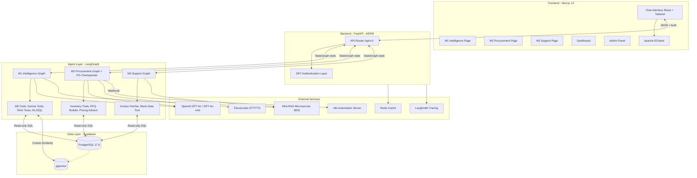

# PROJECT_KNOWLEDGE_BASE

## 1. Executive Summary
Wakeel (وكيل) is an ERP Agentic AI Platform designed to act as an "Agentic Intelligence Layer" operating directly on top of existing ERP databases. Its main business purpose is to transform natural language queries (in Arabic or English) into actionable insights, automate procurement workflows, automate customer support, and enable operational decision-making.

The target users include executives needing financial summaries, operational managers checking inventory/orders, procurement managers managing RFQs, and customer support representatives resolving disputes.

**Core Capabilities & Workflows**:
- **M1 Intelligence Agent**: Dynamic intent classification, safe SQL query generation (template-first + NL2SQL fallback), invoice pattern analysis, and tax reasoning using RAG.
- **M2 Procurement Agent**: End-to-end procurement automation — inventory analysis, pricing advice, RFQ drafting and dispatch via n8n, supplier offer comparison, human approval gates, and voice assistant (STT/TTS via ElevenLabs).
- **M3 Customer Support Agent**: Handles order status inquiries, invoice disputes, and customer history retrieval with human-in-the-loop (HITL) review gates, clarification flows, and conversation memory.
- **Adaptive Output**: Intelligently renders data as metric cards, sortable tables, ECharts, or narratives.
- **Mini-RAG Microservice**: A standalone FastAPI microservice providing document-based Q&A for M3 support knowledge base and tax law queries.

---

## 2. System Architecture Overview
The system follows a modular, decoupled architecture where a React/Next.js frontend communicates via REST with a FastAPI backend. The backend acts as an orchestrator, invoking LangGraph-based AI agent engines that interact securely with a PostgreSQL database (Supabase), a Redis cache, an n8n automation server, and an ElevenLabs speech API.



---

## 3. Repository Structure
```text
project/
├── agents/                 # Core AI logic (LangGraph, nodes, tools, prompts)
│   ├── m1/                 # M1 Intelligence Agent (Fully Operational)
│   │   ├── graphs/         # m1_graph.py — LangGraph state machine
│   │   ├── nodes/          # All M1 nodes (intent, router, NL2SQL, tax RAG, etc.)
│   │   ├── tools/          # db_query_tool, nl2sql_generator, query_gateway, etc.
│   │   └── schemas/        # m1_state.py
│   ├── m2/                 # M2 Procurement Agent (Fully Operational)
│   │   ├── graphs/         # m2_graph.py — LangGraph state machine with PG checkpointer
│   │   ├── nodes/          # RFQ builder, pricing advisor, offer analysis, human approval, etc.
│   │   ├── tools/          # inventory_tools.py
│   │   ├── schemas/        # m2_state.py
│   │   └── checkpointer.py # PostgreSQL-backed LangGraph checkpointer
│   ├── m3/                 # M3 Customer Support Agent (Fully Operational)
│   │   ├── graphs/         # m3_graph.py
│   │   ├── nodes/          # intent router, issue classifier, data fetcher, RAG, escalation, etc.
│   │   ├── tools/          # invoice_fetcher_tool.py, mock_data_tool.py
│   │   └── schemas/        # m3_state.py
│   ├── prompts/            # System prompts for GPT models
│   ├── registry/           # Agent registry utilities
│   └── shared/             # Shared LLM clients, language tools, formatting utilities
├── backend/                # FastAPI backend application (AERIE)
│   ├── api/v1/             # API endpoints/routers (m1, m2_*, m3, auth, reports, admin)
│   ├── core/               # Config, DB connections, Auth, Logging, Redis client
│   ├── middleware/         # Error handlers, CORS
│   ├── models/             # SQLAlchemy ORM models
│   ├── repositories/       # Data access layer (users, conversations, rfqs, offers, etc.)
│   ├── schemas/            # Pydantic request/response schemas
│   └── services/           # Orchestrators, RAG, speech, audit, conversation, session
├── frontend/               # Next.js 14 bilingual chat interface
│   ├── app/                # Pages and routing (m1, m2, m3, dashboard, admin, login)
│   ├── components/         # UI components grouped by module (chat, m1, m2, m3, review, ui)
│   └── lib/                # API clients, RTL utilities
├── MIni-RAG-APP-V1/        # Standalone Mini-RAG microservice (FastAPI, port 8001)
├── n8n/                    # n8n workflow definitions
│   └── workflows/          # m2_workflow1_daily_analysis.json, m2_workflow2_send_rfq.json
├── data/                   # Raw and processed knowledge base documents (e.g., Tax laws)
├── database/               # Schema definitions and migrations
├── deployment/             # Deployment configuration files
├── docs/                   # Architecture maps, execution logs, progress tracking
├── scripts/                # Testing suites, DB seeding, and RAG ingestion scripts
├── specs/                  # Feature specification documents
├── shared/                 # Cross-service shared utilities
├── tests/                  # E2E and integration tests
└── updates/                # Release notes and update logs
```

**Ownership & Dependencies**:
- **`agents/`**: Owned by AI Engineers. Highly dependent on `backend/core/database.py` and LangChain/LangGraph.
- **`backend/`**: Owned by Backend Engineers. Provides the API boundary. Dependent on FastAPI, SQLAlchemy, and Redis.
- **`frontend/`**: Owned by Frontend Engineers. Dependent on Next.js, Tailwind, and ECharts. Interacts only with the `/api` boundary.
- **`MIni-RAG-APP-V1/`**: Independent microservice. Runs on port 8001. M1 and M3 agents call it via HTTP.
- **`n8n/`**: External automation server. M2 triggers it via webhook to dispatch RFQ emails.

---

## 4. Entry Points
- **Backend Application Startup**: `backend/main.py`. This is the FastAPI entry point that wires all routers (M1, M2_*, M3, auth), error handling middleware, and CORS. It also initializes the M2 PostgreSQL checkpointer on startup.
- **AI Agent Execution Flows**:
  - **M1**: `backend/api/v1/m1_query.py` → `backend/services/m1_orchestrator.py` → `agents/m1/graphs/m1_graph.py`
  - **M2**: `backend/api/v1/m2_analyze.py` (and m2_rfqs, m2_offers, m2_pricing, m2_voice, m2_inventory) → `backend/services/m2_orchestrator.py` → `agents/m2/graphs/m2_graph.py`
  - **M3**: `backend/api/v1/m3_support.py` → `backend/services/m3_orchestrator.py` → `agents/m3/graphs/m3_graph.py`
- **Frontend Execution Paths**:
  - `frontend/app/m1/page.tsx` — M1 intelligence chat interface.
  - `frontend/app/m2/page.tsx` — M2 procurement dashboard.
  - `frontend/app/m3/page.tsx` — M3 customer support chat.
  - `frontend/app/dashboard/page.tsx` — Main overview dashboard.
  - `frontend/app/admin/` — Admin audit panel.
- **Mini-RAG Microservice**: `MIni-RAG-APP-V1/main.py` — Runs independently on port 8001.
- **CLI/Background Workers**:
  - Integration tests via `scripts/test_e2e_all_sprints.py`.
  - Document ingestion via `scripts/ingest_tax_docs.py` and `scripts/ingest_mini_rag.py`.

---

## 5. Module Breakdown

### M1 Intelligence Agent
**Purpose**: Transforms natural language queries into analytical insights using ERP data.
**Responsibilities**: Intent classification, SQL generation/execution (template-first + NL2SQL fallback), invoice pattern analysis, tax law RAG retrieval, output format selection, conversation memory, follow-up resolution.
**Key Files/Nodes**:
- `intent_classifier_node.py`: Identifies the user's intent using `gpt-4o-mini` structured JSON output.
- `intent_router_node.py`: Routes to the correct tool based on classified intent.
- `db_query_node.py` / `db_query_tool.py`: Safe, read-only SQL template execution.
- `nl2sql_generator.py` / `nl2sql_repair.py`: Fallback NL-to-SQL for queries without templates; includes AST validation.
- `query_gateway.py`: Gateway that decides template vs. NL2SQL path.
- `invoice_analysis_tool_node.py`: Analyzes invoices for patterns (price changes, late payments).
- `tax_rag_node.py` / `tax_rag_tool.py`: Retrieves tax knowledge via Mini-RAG microservice and generates answers.
- `output_selector_node.py`: Determines the optimal UI component (chart, table, metric card, narrative).
- `context_loader_node.py` / `context_saver_node.py`: Multi-turn conversation memory persistence.
- `clarification_node.py`: Requests clarification from user when intent is ambiguous.
- `followup_resolver_node.py`: Resolves follow-up questions against prior conversation turns.
- `validation_enrichment_node.py`: Post-query anomaly detection using Python thresholds.
- `narrative_generator_node.py`: Calls `gpt-4o` to generate textual summaries.
**Dependencies**: Supabase (Read-only role), pgvector, OpenAI GPT-4o/mini, Mini-RAG microservice.
**Modification Guidelines**: To add a new query type, add a SQL template in `db_query_tool.py`, update `intent_classifier_node.py` if a new intent is needed, and add integration tests.

### M2 Procurement Agent
**Purpose**: Automates end-to-end procurement workflows using ERP data and external services.
**Responsibilities**: Daily inventory analysis, pricing advice, RFQ drafting, supplier offer collection and comparison, final procurement approval, and voice-based interaction.
**Key Files/Nodes**:
- `inventory_check_node.py`: Identifies items below reorder threshold from ERP inventory data.
- `alert_generator_node.py`: Creates structured procurement alerts.
- `pricing_advisor_node.py`: Recommends pricing strategies using historical data.
- `rfq_builder_node.py`: Drafts Request-For-Quotation documents.
- `rfq_send_node.py`: Triggers the `n8n_rfq_webhook_url` to dispatch RFQs to suppliers.
- `await_offers_node.py`: Polls or waits for supplier offer responses.
- `offer_analysis_node.py`: Compares supplier offers using multi-criteria analysis.
- `human_approval_node.py`: Interrupt node requiring manager sign-off before final commitment.
- `final_approval_node.py`: Records the final procurement decision.
- `checkpointer.py`: PostgreSQL-backed LangGraph checkpointer enabling persistent multi-session state for M2.
**Frontend Components**: `AlertsPanel`, `ApprovalButton`, `InventoryTable`, `OfferComparisonView`, `PricingRecommendationsPanel`, `RFQDraftView`, `VoiceAssistantPanel`.
**Dependencies**: Supabase (Read-only for analysis), OpenAI GPT-4o, ElevenLabs (STT/TTS), n8n webhook, PostgreSQL checkpointer.
**Modification Guidelines**: To add a new procurement step, add a node in `agents/m2/nodes/`, wire it into `m2_graph.py`, and add the corresponding API router in `backend/api/v1/`.

### M3 Customer Support Agent
**Purpose**: Automates customer support ticket resolution based on ERP data.
**Responsibilities**: Parses customer issues, classifies intent, fetches ERP data, retrieves KB articles via Mini-RAG, assesses confidence, generates responses, requests clarifications, escalates to humans when needed, and persists conversation memory.
**Key Files/Nodes**:
- `input_parser_node.py`: Extracts structured fields from raw customer messages.
- `intent_router_node.py`: Routes to issue classification or greeting.
- `issue_classifier_node.py`: Classifies the support issue type.
- `data_fetcher_node.py`: Fetches customer/order/invoice data from ERP.
- `data_completeness_node.py`: Checks if enough data exists to resolve the issue.
- `rag_node.py`: Queries Mini-RAG microservice for knowledge base articles.
- `context_builder_node.py`: Assembles full context for response generation.
- `response_generator_node.py`: Generates the final customer-facing response using `gpt-4o`.
- `clarification_node.py`: Requests missing information from the user (max 2 attempts, then escalates).
- `human_review_node.py`: HITL gate for low-confidence cases.
- `escalation_node.py`: Creates escalation tickets for unresolvable cases.
- `greeting_node.py`: Handles initial greetings and session initialization.
**Frontend Components**: `ConfidenceIndicator`, `CustomerInputForm`, `EscalationView`, `HumanReviewPanel`, `TransparencyPanel`.
**Dependencies**: Supabase (Read-only), OpenAI GPT-4o, Mini-RAG microservice.
**Modification Guidelines**: To add a new issue type, update `issue_classifier_node.py` intent list, add handling logic in `context_builder_node.py`, and add M3 KB documents to the Mini-RAG project.

### Mini-RAG Microservice
**Purpose**: Standalone retrieval-augmented generation service providing document Q&A.
**Responsibilities**: Manages multiple knowledge-base projects, embeds documents, performs semantic search, and returns grounded answers.
**Key Facts**: Runs on port 8001. Project ID 1 = M3 Support KB. Project ID 2 = Tax Law KB.
**Entry Point**: `MIni-RAG-APP-V1/main.py`.
**Dependencies**: OpenAI `text-embedding-3-small`, Supabase pgvector.

---

## 6. Data Flow Analysis

### M1 Query Flow
1. **User** types a query in the UI.
2. **Frontend** sends POST to `/api/v1/query`.
3. **API Router** fetches session history from the `conversations` table via `ConversationService`.
4. **LangGraph (M1)** executes: `IntentClassifier` → `IntentRouter` → `QueryGateway` (template or NL2SQL) → `ValidationEnrichment` → `OutputSelector` → `NarrativeGenerator`.
5. **API Router** saves the turn to `conversations` and returns JSON.
6. **Frontend** renders the appropriate component (Bar Chart, Table, Metric Card, Narrative).

### M2 Procurement Flow
1. **Scheduled trigger** or **user action** initiates inventory analysis.
2. **M2 Graph** executes: `InventoryCheck` → `AlertGenerator` → `PricingAdvisor` → `RFQBuilder` → `RFQSend` (triggers n8n webhook) → `AwaitOffers` → `OfferAnalysis` → `HumanApproval` (interrupt) → `FinalApproval`.
3. **Manager** reviews and approves via the `ApprovalButton` frontend component.
4. **PostgreSQL checkpointer** persists graph state across HTTP requests, enabling multi-step approval workflows.

### M3 Support Flow
1. **Customer** submits a support query.
2. **M3 Graph** executes: `InputParser` → `IntentRouter` → `IssueClassifier` → `DataFetcher` → `DataCompleteness` → `RagNode` → `ContextBuilder` → `ResponseGenerator`.
3. If confidence is below threshold → `HumanReview` gate.
4. If data is incomplete → `ClarificationNode` (max 2 rounds).
5. If unresolvable → `EscalationNode`.
6. **Response** is returned to the frontend with a confidence indicator and transparency panel.

---

## 7. API Documentation

### `POST /api/v1/query` (M1 Intelligence)
- **Purpose**: Processes natural language ERP queries.
- **Input**: `{ "query": "string", "language": "auto|ar|en", "session_id": "uuid (optional)" }`
- **Output**: `{ "format": "table|bar_chart|line_chart|metric_card|narrative|alert|error", "data": [], "chart_config": {}, "narrative": "string", "alert": null, "session_id": "uuid" }`
- **Authentication**: JWT Bearer token required.

### M2 Procurement Endpoints
- `POST /api/v1/m2/analyze` — Triggers full procurement analysis cycle via M2 graph.
- `GET /api/v1/m2/inventory` — Returns current inventory status and alerts.
- `POST /api/v1/m2/rfqs` — Creates and dispatches a new RFQ.
- `GET /api/v1/m2/offers` — Retrieves supplier offers for an open RFQ.
- `POST /api/v1/m2/pricing` — Returns pricing recommendations.
- `POST /api/v1/m2/voice` — Handles voice input (STT) and returns voice output (TTS via ElevenLabs).

### `POST /api/v1/support` (M3 Customer Support)
- **Purpose**: Processes customer support queries.
- **Input**: `{ "query": "string", "customer_id": "string (optional)", "session_id": "uuid (optional)" }`
- **Output**: `{ "response": "string", "confidence": float, "requires_human_review": bool, "escalation_id": "uuid|null", "session_id": "uuid" }`
- **Authentication**: JWT Bearer token required.

### Other Endpoints
- `POST /api/v1/auth/login` — Returns JWT access + refresh tokens.
- `GET /api/v1/reports` — Fetches pre-built ERP reports.
- `GET /api/v1/admin/audit` — Returns audit log entries for the admin panel.
- `GET /health` — Liveness probe (no auth required).

**Important Notes**: Errors are caught and returned gracefully, never as unhandled HTTP 500s.

---

## 8. Database Analysis
**Database Type**: PostgreSQL 17.6 (Supabase)
**Extensions**: `pgvector` for vector embeddings.

**Key Tables**:
- `customers` (PK: id): Core CRM data.
- `invoices` (PK: id): Header-level financial data. Relations to `customers`, `orders`, `vendors`.
- `invoice_items` (PK: id): Line items for invoices.
- `orders`, `order_items`, `shipments`: Fulfillment and operational records.
- `transactions`: Core ledger of financial movements.
- `inventory`, `products`: Catalog and stock levels.
- `tax_chunks`: Stores text chunks and vector embeddings of Egyptian Tax Law.
- `conversations`: Stores multi-turn chat history for M1 and M3.
- `sessions`: User session management.
- `users`: Authenticated user accounts.
- `audit_log`: Logs actions for the M3 Human Review gate and admin panel.
- `m2_rfqs`: RFQ records created by the M2 agent.
- `m2_supplier_offers`: Supplier responses to RFQs.
- `m2_inventory_alerts`: Alerts generated by M2 inventory analysis.
- `m2_pricing_recommendations`: Pricing advice records from M2.
- `m3_cases`: M3 support case records with issue type, status, and resolution data.
- `confirmation_tokens`: Email confirmation tokens for auth flows.

**ORM Models**: Located in `backend/models/`. Each table has a corresponding SQLAlchemy model.
**Repositories**: Located in `backend/repositories/`. Clean data access layer separating DB logic from services.

*Business Meaning*: The schema normalizes ERP modules (CRM, Sales, Billing, Inventory, Procurement). Strict separation exists between analytical logs (`conversations`) and business records (`invoices`).

---

## 9. Business Logic Mapping
- **SQL Safety (Read-only)**: A strict constraint dictates that AI agents must **never** mutate core business database state. The `READONLY_DB_URL` environment variable uses a dedicated Postgres role (`erp_readonly`) with SELECT-only privileges.
- **Template-First + NL2SQL Fallback**: M1 uses predefined, parameter-injectable SQL templates for the majority of operations. For unknown query patterns, `nl2sql_generator.py` generates SQL which is validated by `sqlglot` AST checking and repaired via `nl2sql_repair.py` if needed.
- **Anomaly Detection**: Pure Python thresholds execute post-query to detect out-of-bounds expenses (e.g., >200% above average triggers a CRITICAL alert) — deterministic, zero LLM tokens.
- **Output Selection Rules**: A strict logic in `OutputSelectorNode` decides UI rendering (e.g., 2 columns with numeric values → Bar Chart; 1 row/col → Metric Card; free-form → Narrative).
- **M2 Human-in-the-Loop**: The M2 graph uses LangGraph interrupt nodes. The `HumanApprovalNode` pauses graph execution and requires manager sign-off via the frontend before proceeding to `FinalApprovalNode`. The PostgreSQL checkpointer enables state persistence across this pause.
- **M3 Clarification Limit**: The `ClarificationNode` will ask at most `m3_clarification_max_attempts` (default: 2) follow-up questions before automatically escalating to a human agent.
- **M3 Confidence Gate**: Responses below `m3_confidence_review_threshold` (default: 0.70) are routed to the `HumanReviewNode` before delivery.

---

## 10. Configuration & Environment
Managed by `pydantic-settings` in `backend/core/config.py` (class `Settings`).

| Variable | Purpose |
|---|---|
| `DATABASE_URL` | Primary connection pool (write operations, asyncpg) |
| `READONLY_DB_URL` | Agent query connection pool (SELECT only) |
| `OPENAI_API_KEY` | Model inference (GPT-4o, GPT-4o-mini, text-embedding-3-small) |
| `OPENAI_MODEL_PRIMARY` | Primary model (default: `gpt-4o`) |
| `OPENAI_MODEL_FAST` | Fast model (default: `gpt-4o-mini`) |
| `ELEVENLABS_API_KEY` | ElevenLabs STT/TTS for M2 voice assistant |
| `JWT_SECRET_KEY` | JWT signing key |
| `LANGCHAIN_TRACING_V2` | Enable LangSmith tracing |
| `LANGCHAIN_API_KEY` | LangSmith API key |
| `LANGCHAIN_PROJECT` | LangSmith project name (default: `aerie-mvp`) |
| `N8N_RFQ_WEBHOOK_URL` | n8n webhook for M2 RFQ dispatch |
| `MINI_RAG_BASE_URL` | Mini-RAG microservice URL (default: `http://localhost:8001`) |
| `RAG_SUPPORT_KB_PROJECT_ID` | Mini-RAG project ID for M3 support KB (default: 1) |
| `RAG_TAX_PROJECT_ID` | Mini-RAG project ID for tax law (default: 2) |
| `M1_NL2SQL_ENABLED` | Enable NL2SQL fallback in M1 (default: true) |
| `M1_REACT_MAX_ITERATIONS` | Max LangGraph iterations for M1 (default: 5) |
| `M3_CONFIDENCE_REVIEW_THRESHOLD` | Below this score → human review (default: 0.70) |
| `M3_CLARIFICATION_MAX_ATTEMPTS` | Max clarification rounds before escalation (default: 2) |

*Note*: Actual `.env` keys must never be committed. `.env.example` serves as a reference.

---

## 11. External Integrations
- **Supabase / PostgreSQL**: Primary transactional datastore and vector database (pgvector). Failure risk: high.
- **OpenAI**: Core reasoning engine (`gpt-4o`, `gpt-4o-mini`, `text-embedding-3-small`). Failure risk: high, fallback: gracefully fail with an error narrative.
- **ElevenLabs**: Speech-to-Text (STT) and Text-to-Speech (TTS) for the M2 voice assistant. Called via `backend/services/speech_service.py`. Failure risk: medium, fallback: M2 operates in text-only mode.
- **n8n**: Automation server for dispatching RFQ emails to suppliers. Called via HTTP webhook (`N8N_RFQ_WEBHOOK_URL`). Workflow definitions in `n8n/workflows/`. Failure risk: medium, fallback: RFQ saved locally but not dispatched.
- **Mini-RAG Microservice**: Standalone RAG service on port 8001 for M3 support KB and M1 tax law queries. Called by `backend/services/rag_client.py`. Failure risk: medium, fallback: agents respond without KB context.
- **Redis**: Session/cache layer accessed via `backend/core/redis_client.py`. Used for session management and caching. Failure risk: low, fallback: degrades gracefully.
- **LangSmith**: Telemetry and trace logging for all LangGraph chains. Failure risk: low, fallback: degrades to stdout logging.

---

## 12. Dependency Analysis
- **FastAPI**: Core backend framework. Async performance + automatic OpenAPI generation.
- **LangGraph & LangChain**: Stateful orchestration of M1, M2, M3 AI workflows. Crucial for cyclic graphs, interrupt nodes, and checkpointed state.
- **SQLGlot**: Validates SQL ASTs to ensure NL2SQL-generated queries do not contain destructive operations (`UPDATE`, `DELETE`, `DROP`).
- **Pydantic v2 / pydantic-settings**: Data validation and configuration management.
- **SQLAlchemy (async)**: ORM for PostgreSQL access in backend repositories.
- **Next.js 14**: React framework for the frontend.
- **Apache ECharts**: Selected over Recharts for enterprise-grade data visualization.
- **ElevenLabs SDK**: Python client for STT/TTS in M2.
- **Redis (asyncio client)**: Session caching and lightweight state storage.
- **langgraph-checkpoint-postgres**: PostgreSQL-backed checkpointer enabling M2 multi-step human-in-the-loop state persistence.

---

## 13. AI/ML Components
- **Agent Orchestrators**: LangGraph `StateGraph` for M1, M2, and M3. Each module has its own state schema (`m1_state.py`, `m2_state.py`, `m3_state.py`).
- **Intent Classification**: Uses `gpt-4o-mini` with structured JSON output to map unstructured user input to predefined intents.
- **NL2SQL Pipeline (M1)**: `nl2sql_generator.py` converts natural language to SQL using `gpt-4o`; `nl2sql_repair.py` iteratively fixes syntax errors; `sql_policy.py` enforces the read-only safety constraint; `query_gateway.py` decides template vs. NL2SQL path.
- **Tax RAG Pipeline**:
  1. PDF/Text documents are chunked and ingested into the Mini-RAG microservice (project ID 2).
  2. Queries are embedded using `text-embedding-3-small`.
  3. pgvector executes cosine similarity search.
  4. Retrieved context is fed into `gpt-4o` to generate a grounded answer.
- **M3 RAG Pipeline**: Same Mini-RAG service, project ID 1 (Support KB). Used by `rag_node.py` in the M3 graph.
- **Voice Pipeline (M2)**: Audio input → ElevenLabs STT → text query → M2 LangGraph → text response → ElevenLabs TTS → audio output.
- **Prompt Engineering**: Located in `agents/prompts/`. Prompts are strictly bilingual (Arabic/English) and emphasize returning structured JSON.

---

## 14. Deployment Architecture
- **Docker**: `docker-compose.yml` sets up backend and frontend services.
- **Mini-RAG**: Runs as a separate service (`MIni-RAG-APP-V1/`). Must be started independently (port 8001) before the main backend.
- **n8n**: Runs as a separate server. Workflow JSON files in `n8n/workflows/` must be imported into the n8n instance.
- **Database**: Hosted externally on Supabase via connection poolers (port 6543).
- **Deployment Flow**: Targets containerized hosting (e.g., AWS ECS, Render for backend, Vercel for frontend).
- **Migrations**: Located in `scripts/migrations/`. Run via `scripts/run_m2_migrations.py`.

---

## 15. Logging & Monitoring
- **Structlog**: Structured JSON logging in the FastAPI backend for Kibana/Datadog integration. Configured in `backend/core/logging.py`.
- **LangSmith**: Fully integrated for observing LLM traces across M1, M2, and M3. Every agent request creates a trace documenting latency, token usage, and graph trajectory.
- **Audit Log**: `backend/services/audit_service.py` writes sensitive M3 human-review actions to the `audit_log` table, visible in the admin panel.
- **Debugging**: Use the LangSmith trace URL printed to terminal or the LangSmith UI. The `scripts/debug_langsmith_trace.py` script assists in replaying specific traces.

---

## 16. Security Analysis
- **Authentication**: JWT validation enforced on all FastAPI endpoints via `backend/core/auth.py`.
- **Authorization**: Role-based access context is passed to the AI state. The admin panel (`/api/v1/admin/`) requires elevated JWT claims.
- **Data Safety (SQL Injection/Destruction)**: Mitigated by the `erp_readonly` database user (SELECT only) + `sqlglot` AST validation on all NL2SQL-generated queries.
- **CORS**: Restricted to `frontend_base_url` in production.

---

## 17. Technical Debt & Risks
- **High**: The DB schema is currently optimized for mock/demo data. Integrating with a live, messy ERP schema (e.g., SAP, Odoo) will require a robust ETL mapping layer.
- **Medium**: Single-point failure on OpenAI. No fallback to local models (e.g., LLaMa) is implemented. ElevenLabs failure degrades M2 to text-only mode.
- **Medium**: The Mini-RAG microservice is a separate process with no health-check circuit breaker in the main backend. A Mini-RAG outage will cause silent RAG failures in M1 and M3.
- **Low**: RAG context windows. If the knowledge base expands significantly, the fixed `rag_top_k=5` retrieval limit might miss nuanced context without a graph-RAG approach.
- **Low**: n8n dependency for M2 RFQ dispatch. If the n8n server is unavailable, RFQs are drafted but not sent — the failure is logged but not surfaced clearly to the user.

---

## 18. Refactoring Opportunities
- **Mini-RAG Health Check**: Add a startup health check and circuit breaker in `backend/services/rag_client.py` so that Mini-RAG failures are surfaced clearly rather than silently degrading.
- **M2 Offer Polling**: `AwaitOffersNode` currently uses a polling strategy. This could be replaced by an n8n webhook callback to avoid blocking LangGraph state.
- **ECharts Config**: The ECharts configuration mapping in M1's `OutputSelectorNode` is coupled to the backend. This formatting logic should move to the frontend, letting the backend return raw JSON payloads.
- **Service Extraction**: `InvoiceAnalysisToolNode` has large inline methods that could be abstracted into a dedicated `backend/services/invoice_service.py`.

---

## 19. Developer Modification Guide

### Add New API Endpoint
**Files involved**: `backend/api/v1/`, `backend/main.py`
**Steps**: Create router function, inject dependencies, register it in `main.py`.
**Risks**: Ensure error formatting matches frontend expectations (no unhandled 500s).

### Add New Database Table
**Files involved**: Supabase UI → `backend/models/` → `backend/repositories/` → `scripts/migrations/`
**Steps**: Create the table in Supabase. Add SQLAlchemy model. Add repository class. Run migrations.
**Risks**: Breaking existing query templates if schema names overlap.

### Add a New SQL Template to M1
**Files involved**: `agents/m1/tools/db_query_tool.py`, `agents/m1/nodes/intent_classifier_node.py`
**Steps**: Add the `TXX` template in `db_query_tool.py`. If a new intent is needed, update `intent_classifier_node.py`. Add integration tests in `scripts/`.
**Risks**: SQL syntax errors in the template; intent collision with existing classifier categories.

### Add a New M2 Procurement Step
**Files involved**: `agents/m2/nodes/`, `agents/m2/graphs/m2_graph.py`, `backend/api/v1/m2_*.py`
**Steps**: Create the node in `agents/m2/nodes/`. Wire it into the graph in `m2_graph.py`. Expose via an API endpoint if needed.
**Risks**: Breaking the PostgreSQL checkpointer state schema if `m2_state.py` changes incompatibly.

### Add Knowledge Base Documents to M3 or Tax RAG
**Files involved**: `MIni-RAG-APP-V1/`, `scripts/ingest_mini_rag.py`, `scripts/ingest_tax_docs.py`
**Steps**: Place documents in the appropriate `data/` subdirectory. Run the ingestion script targeting the correct Mini-RAG project ID (1 for M3 KB, 2 for Tax).
**Risks**: Embedding dimension mismatch if the OpenAI model is changed.

---

## 20. AI_AGENT_CONTEXT
**Project Purpose**: Wakeel is an Agentic Intelligence Layer acting on ERP data. It understands business intent and fetches SQL data securely, automates procurement, and handles customer support.
**Architecture**: FastAPI/AERIE (Backend) + Next.js 14 (Frontend) + LangGraph (M1/M2/M3 State Machines) + Supabase (PostgreSQL + pgvector) + Mini-RAG (Port 8001) + n8n (RFQ Dispatch) + ElevenLabs (Voice) + Redis (Cache).
**Critical Constraints**:
1. ALWAYS use `READONLY_DB_URL` for AI-generated SQL execution.
2. DO NOT modify the UI unless strictly necessary; it uses a custom Tailwind design system (Gold/Midnight).
3. LangGraph state modifications must conform to the module's state schema (`m1_state.py`, `m2_state.py`, `m3_state.py`).
4. Errors from the AI engine must gracefully return as `{"format": "error", "narrative": "..."}` (M1) or `{"response": "...", "confidence": 0}` (M3) to maintain chat flow.
5. The M2 graph uses a PostgreSQL checkpointer — never change `m2_state.py` schema without a migration plan.
6. The Mini-RAG microservice must be running on port 8001 before starting the main backend; M1 TaxRAG and M3 RAG both depend on it.
**Common Pitfalls**:
- Attempting to execute `UPDATE/DELETE` via the AI agents (will crash — `erp_readonly` role prevents it).
- Breaking Arabic right-to-left UI styling.
- Removing `session_id` logic which breaks multi-turn memory in M1 and M3.
- Calling Mini-RAG without checking if the service is up.
- Triggering n8n webhook in tests (use mock URLs in test environments).

---

## 21. Critical Files Index

**Priority 1 (Must Read)**
- `docs/architecture/db_schema_reference.md`: Source of truth for the database schema. Read before writing any SQL.
- `agents/m1/graphs/m1_graph.py`: M1 orchestrator — defines the full AI flow.
- `agents/m2/graphs/m2_graph.py`: M2 orchestrator — defines procurement workflow with interrupt nodes.
- `agents/m3/graphs/m3_graph.py`: M3 orchestrator — defines customer support flow.
- `backend/main.py`: Application entry point — registers all routers and initializes M2 checkpointer.
- `backend/core/config.py`: All environment variables and feature flags.

**Priority 2**
- `agents/m1/nodes/intent_classifier_node.py`: Determines what the user wants in M1.
- `agents/m1/tools/db_query_tool.py` / `agents/m1/tools/query_gateway.py`: Where M1 data access happens.
- `agents/m1/tools/nl2sql_generator.py`: NL2SQL fallback logic with safety validation.
- `agents/m2/checkpointer.py`: PostgreSQL checkpointer for M2 multi-step persistence.
- `agents/m3/nodes/issue_classifier_node.py`: Determines the M3 support issue type.
- `backend/api/v1/m1_query.py` / `m2_analyze.py` / `m3_support.py`: HTTP boundary to agent execution.
- `backend/services/m1_orchestrator.py` / `m2_orchestrator.py` / `m3_orchestrator.py`: Service layer bridging API to LangGraph.
- `MIni-RAG-APP-V1/main.py`: Mini-RAG microservice entry point.

**Priority 3**
- `frontend/hooks/useM1Query.ts`: Frontend state management for M1 chat.
- `frontend/components/m2/ApprovalButton.tsx`: HITL approval UI for M2.
- `frontend/components/m3/HumanReviewPanel.tsx`: HITL review UI for M3.
- `backend/services/speech_service.py`: ElevenLabs STT/TTS integration.
- `backend/services/rag_client.py`: HTTP client for Mini-RAG microservice.
- `n8n/workflows/m2_workflow2_send_rfq.json`: n8n RFQ dispatch workflow definition.
- `scripts/verify_connections.py`: Utility to validate DB and service connectivity.
