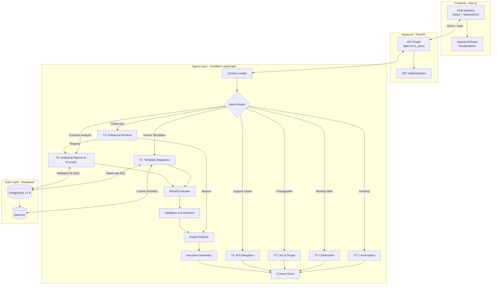
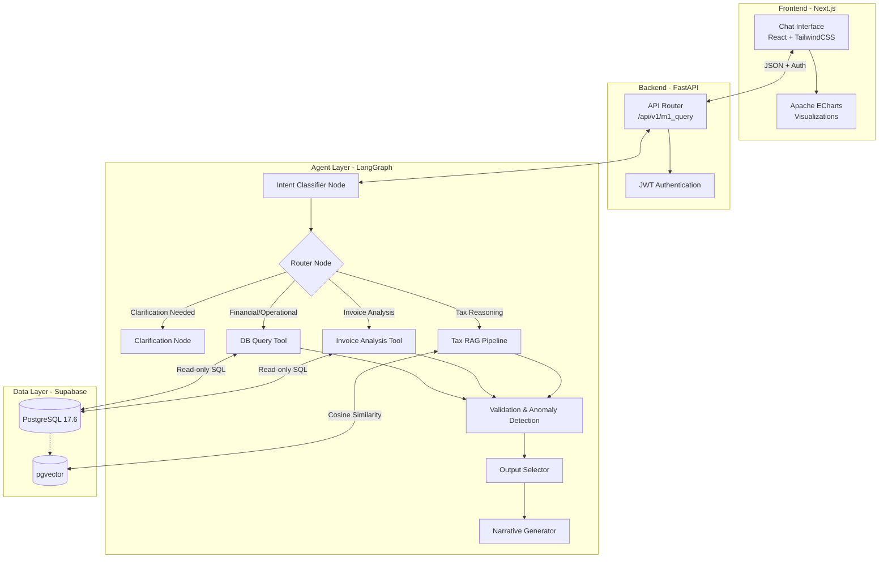

# Wakeel (وكيل) - ERP Agentic AI Platform (v2.0)

Wakeel is a comprehensive Agentic AI platform built on top of ERP data. It leverages Large Language Models (GPT-4o / GPT-4o-mini), LangGraph for orchestration, and a modern web stack to provide intelligent insights, proactive anomaly detection, and interactive bilingual (Arabic/English) chat interfaces.

## 🚀 Current Status

- **M1 (Intelligence Agent)**: Fully Operational (Sprints 0-6 Completed). Features intent classification, dynamic SQL querying, complex invoice analysis, multi-stage Tax RAG pipeline, proactive anomaly detection, and a full Next.js UI.
- **M2 (Procurement Agent)**: Deferred for future iterations.
- **M3 (Customer Support Agent)**: Sprint 0 completed (Database mock tables). Development starting soon.

## 🏗 System Architecture (v2.0 - Hybrid Stratified Routing)

The new architecture introduces a "Stratified Routing" model. Every request is routed into specific execution tiers (T0 to T6), decoupling conversational intent from database analytical execution. This ensures that analytical complexity is bounded, safer, and supports dynamic valid NL2SQL execution for complex queries.



### 🔄 Differences & Improvements (v2.0 vs v1.0)

Version 2.0 transforms Wakeel from an "ERP Chatbot" to a true **Context-Aware Data Analyst Copilot**.
- **Execution Tiers (T0-T6)**: Replaced a flat intent router with 7 distinct execution tiers to differentiate between greetings (T0), template queries (T1), follow-ups (T2), and complex multi-step analytics (T3).
- **Dynamic NL2SQL (T3)**: v1.0 only relied on predefined templates. v2.0 introduces a bounded SQL generation and repair loop that can safely generate dynamic SQL for out-of-bounds questions while strictly adhering to read-only DB permissions and an authorized schema catalog.
- **Result Evaluation**: v2.0 adds a `ResultEvaluatorNode` that verifies if the returned data semantically covers the user's question before responding, preventing hallucinated explanations over incomplete data.
- **Context Persistence**: Replaced simple chat history with structured `analysis_frame` tracking. The agent now remembers the precise metrics, dimensions, and filters of previous turns for seamless drill-down (T2).
- **Delegation**: Native T6 delegation to the upcoming M3 Customer Support agent instead of handling support tickets within the analytical agent.

---

## 🏛 Legacy Architecture (v1.0)

<details>
<summary>Click to view the previous v1.0 Architecture</summary>


</details>

## ✨ Key Features (M1 Intelligence Agent)

- **Dynamic Intent Classification**: Automatically routes queries (e.g., Financial, Operational, Tax, Invoice Analysis) and detects language (Arabic/English).
- **SQL Query Generation & Execution**: Safely builds and executes read-only SQL queries against ERP data using 10 optimized templates and `sqlglot` AST validation.
- **Advanced Invoice Analysis**: Detects patterns such as late payments, vendor price increases, and concentration risk.
- **Legal Tax RAG Pipeline**: Uses `text-embedding-3-small` and `pgvector` to semantically search Egyptian Tax laws with hybrid retrieval and reranking.
- **Proactive Anomaly Detection**: Pure-Python thresholds detect out-of-bounds expenses and data anomalies before displaying them to the user.
- **Adaptive Output Formatting**: Intelligently selects the best format to display data: Metric Cards, Sortable Tables, ECharts (Bar/Line), Narratives, or Alerts.
- **Bilingual UI**: Full RTL and LTR support with localized currency/number formatting.

## 🛠 Tech Stack

- **Frontend**: Next.js 14, React, Tailwind CSS 3.4, Apache ECharts
- **Backend**: Python 3.11, FastAPI, SQLAlchemy (Async)
- **AI & Orchestration**: LangGraph, LangChain, OpenAI (GPT-4o, GPT-4o-mini)
- **Database**: Supabase PostgreSQL 17.6, `pgvector`
- **Observability**: LangSmith

## 📂 Project Structure

```
.
├── agents/             # LangGraph agent definitions, nodes, tools, and prompts
│   ├── m1/             # M1 Intelligence Agent (Fully Operational)
│   ├── m3/             # M3 Customer Support Agent (Placeholders)
│   └── shared/         # Shared LLM clients
├── backend/            # FastAPI backend, API routes, Database connections
├── frontend/           # Next.js 14 bilingual chat interface
├── data/               # Raw and processed knowledge base documents (e.g., Tax laws)
├── docs/               # Architecture maps, execution logs, progress tracking
└── scripts/            # Testing suites, DB seeding, and RAG ingestion scripts
```

## 🏁 Getting Started

### Prerequisites
- Python 3.11+
- Node.js 20+
- Supabase account (or local PostgreSQL with pgvector)

### Installation

1. **Clone the repository**
   ```bash
   git clone <repo-url>
   cd Wakeel
   ```

2. **Environment Setup**
   Ensure `.env` in the root and `frontend/.env.local` are configured correctly. You will need:
   - `OPENAI_API_KEY`
   - `DATABASE_URL` (Supabase Pooler)
   - `READONLY_DB_URL`

3. **Start the Backend**
   ```bash
   pip install -r backend/requirements.txt
   pip install -r agents/requirements.txt
   python -m uvicorn backend.main:app --reload --port 8000
   ```
   *You can view the interactive API documentation at `http://localhost:8000/docs`.*

4. **Start the Frontend**
   ```bash
   cd frontend
   npm install
   npm run dev
   ```

5. Access the interface at `http://localhost:3000/m1`.

## 🧪 Testing

The repository includes extensive testing scripts:
- **E2E Integration**: Run `python scripts/test_e2e_all_sprints.py` to verify the entire M1 pipeline (Sprints 1-5).
- **RAG Testing**: Run `python scripts/test_rag.py` to test semantic search and LLM extraction.
- **Unit Tests**: Check individual sprint tests (e.g., `test_sprint3.py`, `test_sprint5.py`).

## 📜 Architectural Constraints
- All AI queries to the database **must** use the `READONLY_DB_URL` connection.
- No direct schema modifications from agents. All DB access is secured via explicit tool nodes.
- Odoo and OCR modules have been archived in favor of direct Supabase PostgreSQL integration.

---
*Refer to `docs/progress/agent_execution_log.md` for the comprehensive history of the project's evolution.*
