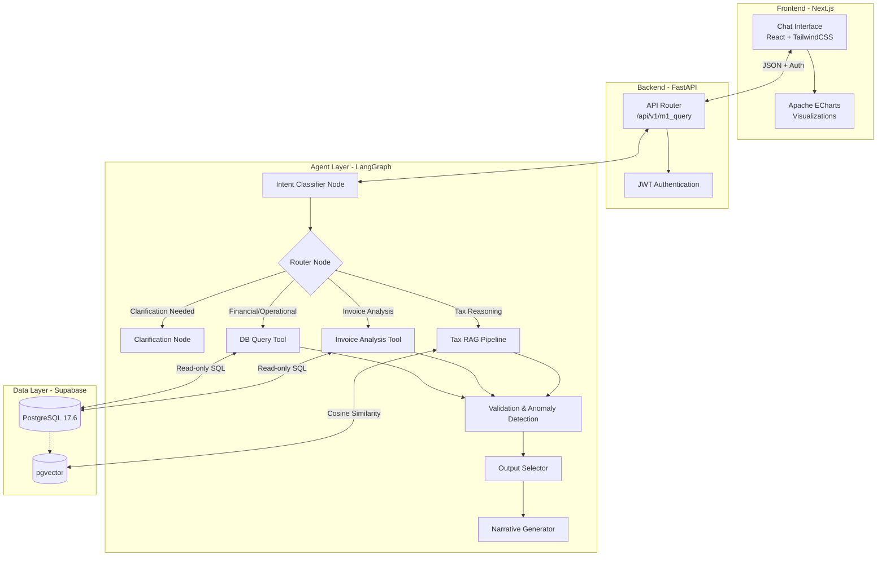

# Wakeel (وكيل) - ERP Agentic AI Platform

Wakeel is a comprehensive Agentic AI platform built on top of ERP data. It leverages Large Language Models (GPT-4o / GPT-4o-mini), LangGraph for orchestration, and a modern web stack to provide intelligent insights, proactive anomaly detection, and interactive bilingual (Arabic/English) chat interfaces.

## 🚀 Current Status

- **M1 (Intelligence Agent)**: Fully Operational (Sprints 0-6 Completed). Features intent classification, dynamic SQL querying, complex invoice analysis, multi-stage Tax RAG pipeline, proactive anomaly detection, and a full Next.js UI.
- **M2 (Procurement Agent)**: Deferred for future iterations.
- **M3 (Customer Support Agent)**: Sprint 0 completed (Database mock tables). Development starting soon.

## 🏗 System Architecture



## ✨ Key Features (M1 Intelligence Agent)

- **Dynamic Intent Classification**: Automatically routes queries (e.g., Financial, Operational, Tax, Invoice Analysis) and detects language (Arabic/English).
- **SQL Query Generation & Execution**: Safely builds and executes read-only SQL queries against ERP data using 10 optimized templates and `sqlglot` AST validation.
- **Advanced Invoice Analysis**: Detects patterns such as late payments, vendor price increases, and concentration risk.
- **Legal Tax RAG Pipeline**: Uses `text-embedding-3-small` and `pgvector` to semantically search Egyptian Tax laws with hybrid retrieval and reranking.
- **Proactive Anomaly Detection**: Pure-Python thresholds detect out-of-bounds expenses and data anomalies before displaying them to the user.
- **Adaptive Output Formatting**: Intelligently selects the best format to display data: Metric Cards, Sortable Tables, ECharts (Bar/Line), Narratives, or Alerts.
- **Bilingual UI**: Full RTL and LTR support with localized currency/number formatting.

## 🛠 Tech Stack

- **Frontend**: Next.js 14, React, Tailwind CSS 3.4, Apache ECharts
- **Backend**: Python 3.11, FastAPI, SQLAlchemy (Async)
- **AI & Orchestration**: LangGraph, LangChain, OpenAI (GPT-4o, GPT-4o-mini)
- **Database**: Supabase PostgreSQL 17.6, `pgvector`
- **Observability**: LangSmith

## 📂 Project Structure

```
.
├── agents/             # LangGraph agent definitions, nodes, tools, and prompts
│   ├── m1/             # M1 Intelligence Agent (Fully Operational)
│   ├── m3/             # M3 Customer Support Agent (Placeholders)
│   └── shared/         # Shared LLM clients
├── backend/            # FastAPI backend, API routes, Database connections
├── frontend/           # Next.js 14 bilingual chat interface
├── data/               # Raw and processed knowledge base documents (e.g., Tax laws)
├── docs/               # Architecture maps, execution logs, progress tracking
└── scripts/            # Testing suites, DB seeding, and RAG ingestion scripts
```

## 🏁 Getting Started

### Prerequisites
- Python 3.11+
- Node.js 20+
- Supabase account (or local PostgreSQL with pgvector)

### Installation

1. **Clone the repository**
   ```bash
   git clone <repo-url>
   cd Wakeel
   ```

2. **Environment Setup**
   Ensure `.env` in the root and `frontend/.env.local` are configured correctly. You will need:
   - `OPENAI_API_KEY`
   - `DATABASE_URL` (Supabase Pooler)
   - `READONLY_DB_URL`

3. **Start the Backend**
   ```bash
   pip install -r backend/requirements.txt
   pip install -r agents/requirements.txt
   python -m uvicorn backend.main:app --reload --port 8000
   ```
   *You can view the interactive API documentation at `http://localhost:8000/docs`.*

4. **Start the Frontend**
   ```bash
   cd frontend
   npm install
   npm run dev
   ```

5. Access the interface at `http://localhost:3000/m1`.

## 🧪 Testing

The repository includes extensive testing scripts:
- **E2E Integration**: Run `python scripts/test_e2e_all_sprints.py` to verify the entire M1 pipeline (Sprints 1-5).
- **RAG Testing**: Run `python scripts/test_rag.py` to test semantic search and LLM extraction.
- **Unit Tests**: Check individual sprint tests (e.g., `test_sprint3.py`, `test_sprint5.py`).

## 📜 Architectural Constraints
- All AI queries to the database **must** use the `READONLY_DB_URL` connection.
- No direct schema modifications from agents. All DB access is secured via explicit tool nodes.
- Odoo and OCR modules have been archived in favor of direct Supabase PostgreSQL integration.

---
*Refer to `docs/progress/agent_execution_log.md` for the comprehensive history of the project's evolution.*
