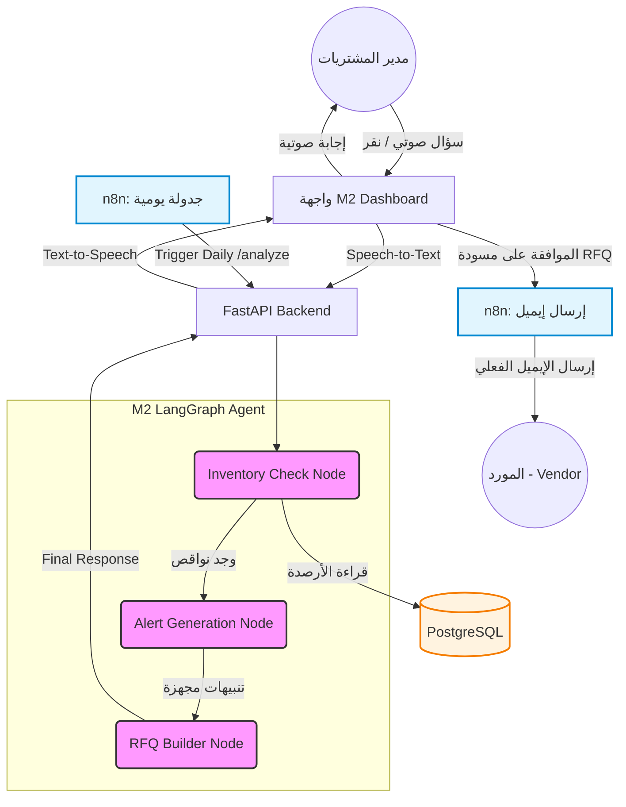

# M2 Architecture: Purchasing & Inventory Agent

## 1. Overview
يُعد موديول (M2) بمثابة وكيل ذكي مستقل داخل طبقة الـ Agentic ERP، وهو مصمم خصيصاً لمراقبة المخزون، وتحليل النواقص، وتجهيز مسودات طلبات الشراء (RFQs) بشكل استباقي، مع واجهة تفاعلية تدعم الأوامر الصوتية (Speech-to-Speech) وأتمتة المهام عبر n8n.

## 2. Core Components

### 2.1 LangGraph State Schema
تعتمد بنية الـ Agent على تمرير وتحديث حالة (State) متكاملة بين الـ Nodes، وهي مُعرفة في `agents/m2/schemas/m2_state.py`:
```python
class M2State(TypedDict, total=False):
    trigger: Literal["manual", "scheduled"]
    language: Literal["ar", "en"]
    inventory_items: list          # Raw inventory items from DB
    low_stock_items: list          # Items where qty <= reorder_point
    alerts: list                   # AI-generated alerts {product_id, message, severity}
    rfq_drafts: list               # AI-generated RFQ emails
    final_response: dict
    error: str
```

### 2.2 LangGraph Nodes Flow
مسار الوكيل يعمل كالتالي (`agents/m2/graphs/m2_graph.py`):
1. **`inventory_check_node`**: يتصل بقاعدة البيانات ويستخرج `low_stock_items`.
2. **`alert_generation_node`**: يستخدم (LLM) لتحليل كل منتج ناقص واقتراح خطة عمل وتوليد رسالة تنبيه.
3. **`rfq_builder_node`**: يستخدم (LLM) لهندسة وكتابة إيميل رسمي للمورد (Vendor) يطلب فيه الكميات الناقصة، ويدعم توليد الرد بالعامية المصرية أو الإنجليزية.

#### M2 Architecture & Integration Diagram



## 3. Integrations

### 3.1 Speech-to-Speech Integration
يتم تحقيق واجهة التفاعل الصوتي لمدير المشتريات عبر:
- **STT (Speech-to-Text):** من خلال واجهة المتصفح (Web Speech API) أو `OpenAI Whisper` لتحويل الأوامر مثل *"إيه النواقص النهاردة؟"*.
- **TTS (Text-to-Speech):** يتم أخذ رد الوكيل وإمراره على `ElevenLabs` أو `OpenAI Audio API` لينطقه بلهجة **مصرية عامية** أو لغة **إنجليزية** طبيعية ليسمعها المستخدم مباشرة.

### 3.2 n8n Workflow Automation
يتم الاعتماد على `n8n` لأتمتة دورة الـ M2 في نقطتين مفصليتين:
1. **Scheduled Alerts (الجدولة الزمنية):**
   - يعمل Cron Job يومي داخل n8n لطلب `POST /api/v1/m2/analyze`.
   - يقوم n8n بتنسيق النتيجة (JSON) وإرسالها كرسالة WhatsApp/Email لمدير المشتريات لوجود نواقص تستدعي الانتباه.
2. **Automated RFQ Sending (إرسال الإيميلات):**
   - عند ضغط المدير على "موافقة وإرسال" في واجهة M2، يتم إرسال طلب Webhook لـ n8n.
   - يتولى n8n مهمة إرسال مسودة الـ RFQ المعتمدة كإيميل رسمي للمورد.

## 4. API Endpoints
يتم خدمة واجهات المستخدم و n8n من خلال `backend/api/v1/m2_inventory.py`:
- `GET /api/v1/m2/inventory`: لجلب الجداول العادية.
- `POST /api/v1/m2/analyze`: وهو المحرك الأساسي الذي يشغّل الـ LangGraph ويرجع بـ `alerts` و `rfq_drafts`.
