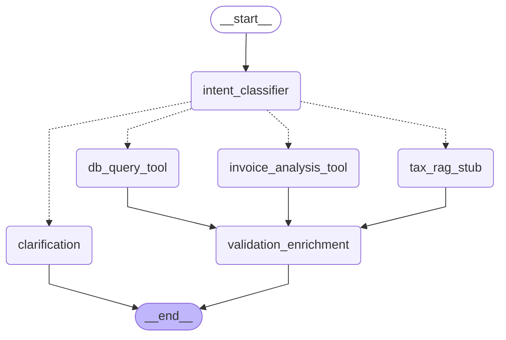

# M1 Agent Graph Diagram

> Auto-generated diagram representing the current flow of M1 Agent.

```mermaid
---
config:
  flowchart:
    curve: linear
---
graph TD;
	__start__([<p>__start__</p>]):::first
	intent_classifier(intent_classifier)
	clarification(clarification)
	db_query_tool(db_query_tool)
	invoice_analysis_tool(invoice_analysis_tool)
	tax_rag_stub(tax_rag_stub)
	validation_enrichment(validation_enrichment)
	__end__([<p>__end__</p>]):::last
	__start__ --> intent_classifier;
	db_query_tool --> validation_enrichment;
	intent_classifier -.-> clarification;
	intent_classifier -.-> db_query_tool;
	intent_classifier -.-> invoice_analysis_tool;
	intent_classifier -.-> tax_rag_stub;
	invoice_analysis_tool --> validation_enrichment;
	tax_rag_stub --> validation_enrichment;
	clarification --> __end__;
	validation_enrichment --> __end__;
	classDef default fill:#f2f0ff,line-height:1.2
	classDef first fill-opacity:0
	classDef last fill:#bfb6fc

```
