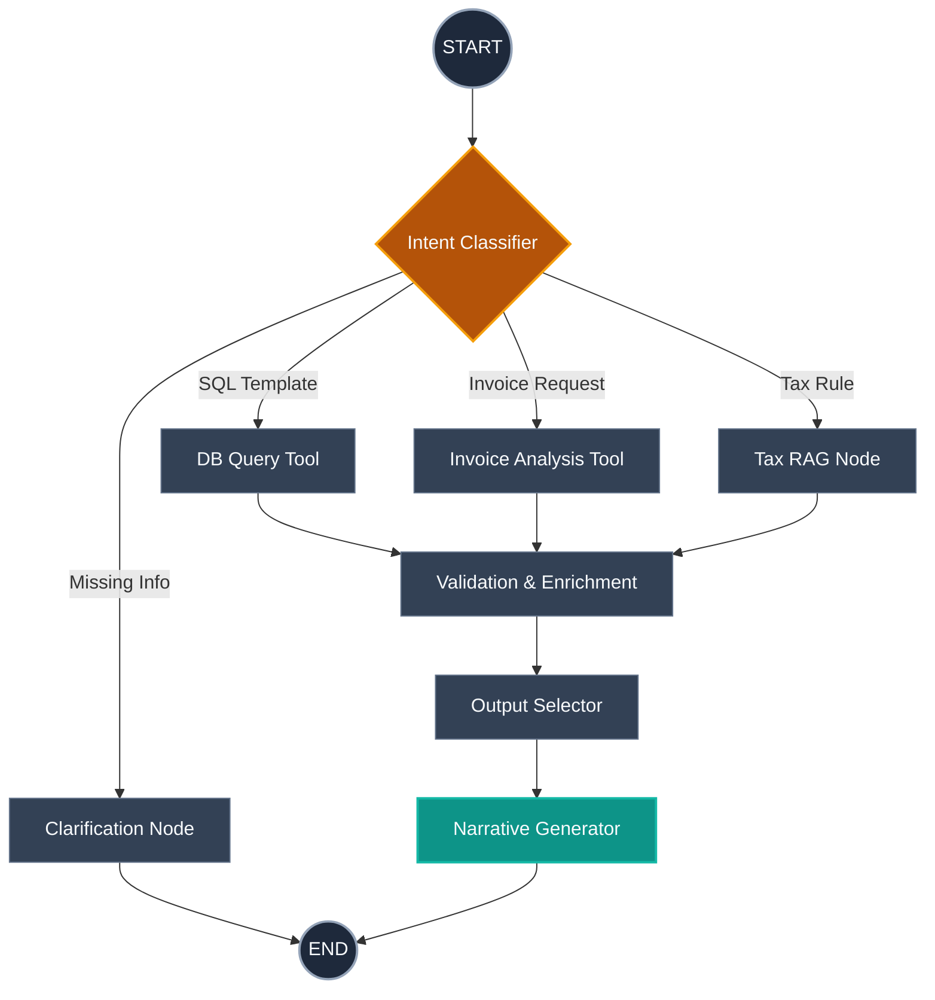
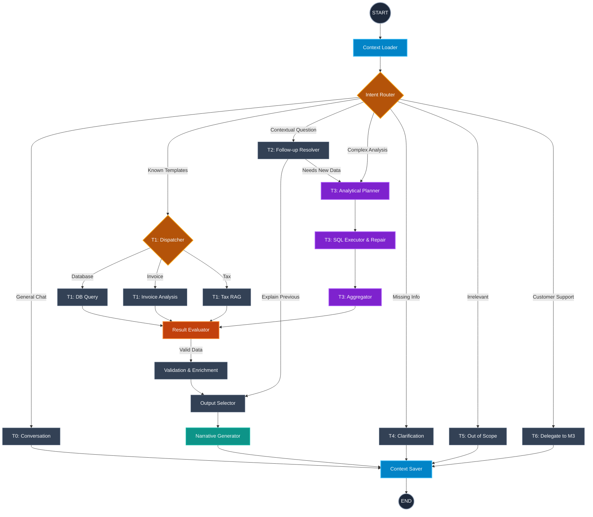

# تطور البنية المعمارية (Architecture Evolution)

فيما يلي رسم توضيحي بيقارن بين البنية القديمة (Legacy) والبنية الجديدة (Stratified) للنظام.

## 1. البنية القديمة (Legacy Architecture)
كانت البنية القديمة بسيطة وتعتمد على تصنيف النية (Intent) بشكل مباشر لتوجيه السؤال، وكانت تفتقر للذاكرة التحليلية المتقدمة.

---

## 2. البنية الجديدة المتقدمة (New Stratified Architecture)
البنية الحالية تعمل بمسارات طبقية (Tiers) وتحتوي على ذاكرة للسياق، مقيّم للنتائج، وقدرة على إنشاء أوامر SQL بشكل ديناميكي (NL2SQL) مع تصحيحها ذاتياً.

### أبرز الفروق الجوهرية اللي هتلاحظها في الرسمتين:
1. **الذاكرة (Context Loader & Saver):** في البنية الجديدة، الدورة بتبدأ بتحميل السياق من الداتا بيز وبتنتهي بحفظ الإطار التحليلي الجديد، عشان النظام يفتكر انتوا كنتوا بتتكلموا في إيه.
2. **المسارات (Tiers):** بدل ما كل الأسئلة تروح على نفس الأداة، بقى فيه مسارات متخصصة (زي T3 للتحليل المعقد، و T6 لتحويل أسئلة الدعم الفني).
3. **مقيّم النتائج (Result Evaluator):** خطوة أمان جديدة في النص بتقيّم الداتا اللي طالعة من الـ Database قبل ما توصل لمرحلة توليد النص، عشان تتأكد إن الإجابة مدعومة بأرقام حقيقية.
